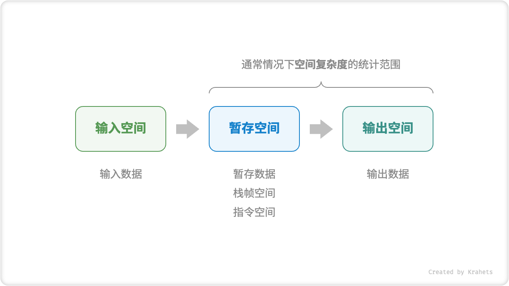
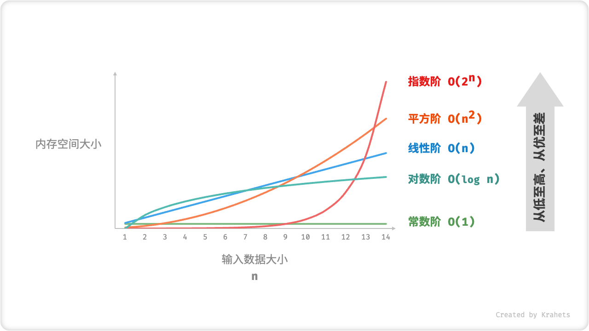
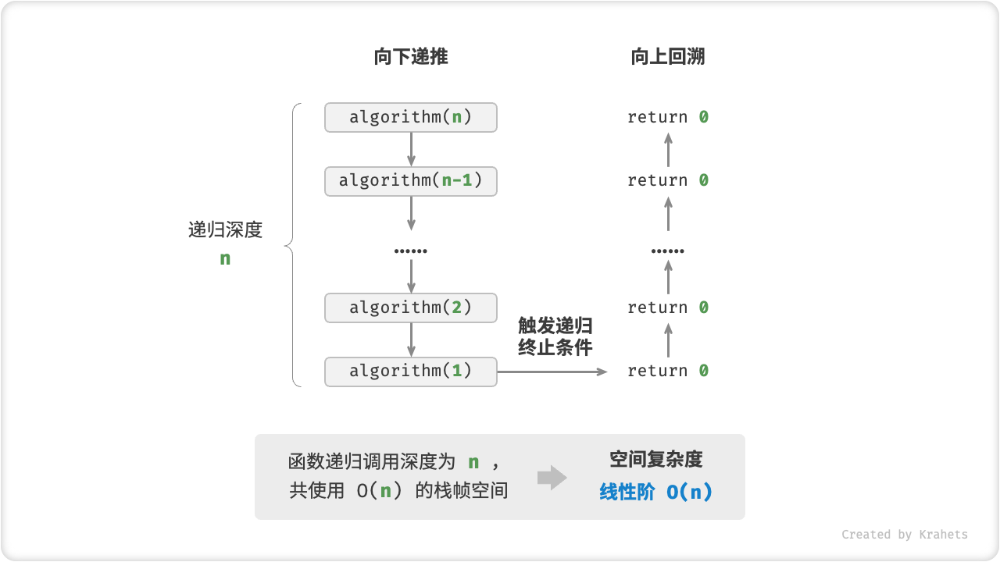
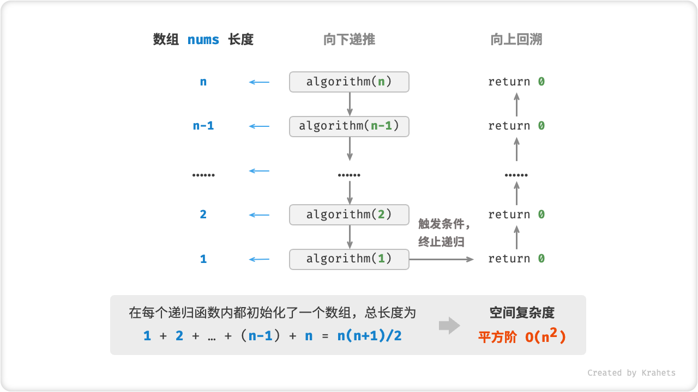
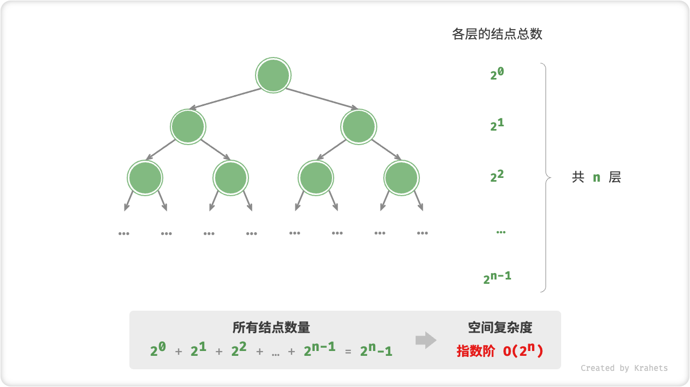

# 空间复杂度

「空间复杂度 Space Complexity」统计 **算法使用内存空间随着数据量变大时的增长趋势**。这个概念与时间复杂度很类似。

## 算法相关空间

算法运行中，使用的内存空间主要有以下几种：

- 「输入空间」用于存储算法的输入数据；
- 「暂存空间」用于存储算法运行中的变量、对象、函数上下文等数据；
- 「输出空间」用于存储算法的输出数据；

!!! tip

    通常情况下，空间复杂度统计范围是「暂存空间」+「输出空间」。

暂存空间可分为三个部分：

- 「暂存数据」用于保存算法运行中的各种 **常量、变量、对象** 等。
- 「栈帧空间」用于保存调用函数的上下文数据。系统每次调用函数都会在栈的顶部创建一个栈帧，函数返回时，栈帧空间会被释放。
- 「指令空间」用于保存编译后的程序指令，**在实际统计中一般忽略不计**。



<p align="center"> Fig. 算法使用的相关空间 </p>

=== "Java"

    ```java title=""
    /* 类 */
    class Node {
        int val;
        Node next;
        Node(int x) { val = x; }
    }
    
    /* 函数 */
    int function() {
        // do something...
        return 0;
    }
    
    int algorithm(int n) {        // 输入数据
        final int a = 0;          // 暂存数据（常量）
        int b = 0;                // 暂存数据（变量）
        Node node = new Node(0);  // 暂存数据（对象）
        int c = function();       // 栈帧空间（调用函数）
        return a + b + c;         // 输出数据
    }
    ```

=== "C++"

    ```cpp title=""
    /* 结构体 */
    struct Node {
        int val;
        Node *next;
        Node(int x) : val(x), next(nullptr) {}
    };

    /* 函数 */
    int func() {
        // do something...
        return 0;
    }

    int algorithm(int n) {        // 输入数据
        const int a = 0;          // 暂存数据（常量）
        int b = 0;                // 暂存数据（变量）
        Node* node = new Node(0);  // 暂存数据（对象）
        int c = func();       // 栈帧空间（调用函数）
        return a + b + c;         // 输出数据
    }
    ```

=== "Python"

    ```python title=""
    """ 类 """
    class Node:
        def __init__(self, x):
            self.val = x      # 结点值
            self.next = None  # 指向下一结点的指针（引用）

    """ 函数 """
    def function():
        # do something...
        return 0

    def algorithm(n):     # 输入数据
        b = 0             # 暂存数据（变量）
        node = Node(0)    # 暂存数据（对象）
        c = function()    # 栈帧空间（调用函数）
        return a + b + c  # 输出数据
    ```

=== "Go"

    ```go title=""
    /* 结构体 */
    type node struct {
        val  int
        next *node
    }

    /* 创建 node 结构体  */
    func newNode(val int) *node {
        return &node{val: val}
    }
    
    /* 函数 */
    func function() int {
        // do something...
        return 0
    }

    func algorithm(n int) int { // 输入数据
        const a = 0             // 暂存数据（常量）
        b := 0                  // 暂存数据（变量）
        newNode(0)              // 暂存数据（对象）
        c := function()         // 栈帧空间（调用函数）
        return a + b + c        // 输出数据
    }
    ```

=== "JavaScript"

    ```javascript title=""
    /* 类 */
    class Node {
        val;
        next;
        constructor(val) {
            this.val = val === undefined ? 0 : val; // 结点值
            this.next = null;                       // 指向下一结点的引用
        }
    }

    /* 函数 */
    function constFunc() {
        // do something
        return 0;
    }

    function algorithm(n) {       // 输入数据
        const a = 0;              // 暂存数据（常量）
        const b = 0;              // 暂存数据（变量）
        const node = new Node(0); // 暂存数据（对象）
        const c = constFunc();    // 栈帧空间（调用函数）
        return a + b + c;         // 输出数据
    }
    ```

=== "TypeScript"

    ```typescript title=""
    /* 类 */
    class Node {
        val: number;
        next: Node | null;
        constructor(val?: number) {
            this.val = val === undefined ? 0 : val; // 结点值
            this.next = null;                       // 指向下一结点的引用
        }
    }

    /* 函数 */
    function constFunc(): number {
        // do something
        return 0;
    }

    function algorithm(n: number): number { // 输入数据
        const a = 0;                        // 暂存数据（常量）
        const b = 0;                        // 暂存数据（变量）
        const node = new Node(0);           // 暂存数据（对象）
        const c = constFunc();              // 栈帧空间（调用函数）
        return a + b + c;                   // 输出数据
    }
    ```

=== "C"

    ```c title=""

    ```

=== "C#"

    ```csharp title=""
    /* 类 */
    class Node
    {
        int val;
        Node next;
        Node(int x) { val = x; }
    }

    /* 函数 */
    int function()
    {
        // do something...
        return 0;
    }

    int algorithm(int n)          // 输入数据
    {
        int a = 0;                // 暂存数据（常量）
        int b = 0;                // 暂存数据（变量）
        Node node = new Node(0);  // 暂存数据（对象）
        int c = function();       // 栈帧空间（调用函数）
        return a + b + c;         // 输出数据
    }
    ```

=== "Swift"

    ```swift title=""
    /* 类 */
    class Node {
        var val: Int
        var next: Node?

        init(x: Int) {
            val = x
        }
    }

    /* 函数 */
    func function() -> Int {
        // do something...
        return 0
    }

    func algorithm(n: Int) -> Int { // 输入数据
        let a = 0 // 暂存数据（常量）
        var b = 0 // 暂存数据（变量）
        let node = Node(x: 0) // 暂存数据（对象）
        let c = function() // 栈帧空间（调用函数）
        return a + b + c // 输出数据
    }
    ```

=== "Zig"

    ```zig title=""

    ```

## 推算方法

空间复杂度的推算方法和时间复杂度总体类似，只是从统计“计算操作数量”变为统计“使用空间大小”。与时间复杂度不同的是，**我们一般只关注「最差空间复杂度」**。这是因为内存空间是一个硬性要求，我们必须保证在所有输入数据下都有足够的内存空间预留。

**最差空间复杂度中的“最差”有两层含义**，分别为输入数据的最差分布、算法运行中的最差时间点。

- **以最差输入数据为准**。当 $n < 10$ 时，空间复杂度为 $O(1)$ ；但是当 $n > 10$ 时，初始化的数组 `nums` 使用 $O(n)$ 空间；因此最差空间复杂度为 $O(n)$ ；
- **以算法运行过程中的峰值内存为准**。程序在执行最后一行之前，使用 $O(1)$ 空间；当初始化数组 `nums` 时，程序使用 $O(n)$ 空间；因此最差空间复杂度为 $O(n)$ ；

=== "Java"

    ```java title=""
    void algorithm(int n) {
        int a = 0;                   // O(1)
        int[] b = new int[10000];    // O(1)
        if (n > 10)
            int[] nums = new int[n]; // O(n)
    }
    ```

=== "C++"

    ```cpp title=""
    void algorithm(int n) {
        int a = 0;               // O(1)
        vector<int> b(10000);    // O(1)
        if (n > 10)
            vector<int> nums(n); // O(n)
    }
    ```

=== "Python"

    ```python title=""
    def algorithm(n):
        a = 0               # O(1)
        b = [0] * 10000     # O(1)
        if n > 10:
            nums = [0] * n  # O(n)
    ```

=== "Go"

    ```go title=""
    func algorithm(n int) {
        a := 0                      // O(1)
        b := make([]int, 10000)     // O(1)
        var nums []int
        if n > 10 {
            nums := make([]int, n)  // O(n)
        }
        fmt.Println(a, b, nums)
    }
    ```

=== "JavaScript"

    ```javascript title=""
    function algorithm(n) {
        const a = 0;                   // O(1)
        const b = new Array(10000);    // O(1)
        if (n > 10) {
            const nums = new Array(n); // O(n)
        }
    }
    ```

=== "TypeScript"

    ```typescript title=""
    function algorithm(n: number): void {
        const a = 0;                   // O(1)
        const b = new Array(10000);    // O(1)
        if (n > 10) {
            const nums = new Array(n); // O(n)
        }
    }
    ```

=== "C"

    ```c title=""

    ```

=== "C#"

    ```csharp title=""
    void algorithm(int n)
    {
        int a = 0;                   // O(1)
        int[] b = new int[10000];    // O(1)
        if (n > 10)
        {
            int[] nums = new int[n]; // O(n)
        }
    }
    ```

=== "Swift"

    ```swift title=""
    func algorithm(n: Int) {
        let a = 0 // O(1)
        let b = Array(repeating: 0, count: 10000) // O(1)
        if n > 10 {
            let nums = Array(repeating: 0, count: n) // O(n)
        }
    }
    ```

=== "Zig"

    ```zig title=""

    ```

**在递归函数中，需要注意统计栈帧空间**。例如函数 `loop()`，在循环中调用了 $n$ 次 `function()` ，每轮中的 `function()` 都返回并释放了栈帧空间，因此空间复杂度仍为 $O(1)$ 。而递归函数 `recur()` 在运行中会同时存在 $n$ 个未返回的 `recur()` ，从而使用 $O(n)$ 的栈帧空间。

=== "Java"

    ```java title=""
    int function() {
        // do something
        return 0;
    }
    /* 循环 O(1) */
    void loop(int n) {
        for (int i = 0; i < n; i++) {
            function();
        }
    }
    /* 递归 O(n) */
    void recur(int n) {
        if (n == 1) return;
        return recur(n - 1);
    }
    ```

=== "C++"

    ```cpp title=""
    int func() {
        // do something
        return 0;
    }
    /* 循环 O(1) */
    void loop(int n) {
        for (int i = 0; i < n; i++) {
            func();
        }
    }
    /* 递归 O(n) */
    void recur(int n) {
        if (n == 1) return;
        return recur(n - 1);
    }
    ```

=== "Python"

    ```python title=""
    def function():
        # do something
        return 0

    """ 循环 O(1) """
    def loop(n):
        for _ in range(n):
            function()

    """ 递归 O(n) """
    def recur(n):
        if n == 1: return
        return recur(n - 1)
    ```

=== "Go"

    ```go title=""
    func function() int {
        // do something
        return 0
    }
    
    /* 循环 O(1) */
    func loop(n int) {
        for i := 0; i < n; i++ {
            function()
        }
    }
    
    /* 递归 O(n) */
    func recur(n int) {
        if n == 1 {
            return
        }
        recur(n - 1)
    }
    ```

=== "JavaScript"

    ```javascript title=""
    function constFunc() {
        // do something
        return 0;
    }
    /* 循环 O(1) */
    function loop(n) {
        for (let i = 0; i < n; i++) {
            constFunc();
        }
    }
    /* 递归 O(n) */
    function recur(n) {
        if (n === 1) return;
        return recur(n - 1);
    }
    ```

=== "TypeScript"

    ```typescript title=""
    function constFunc(): number {
        // do something
        return 0;
    }
    /* 循环 O(1) */
    function loop(n: number): void {
        for (let i = 0; i < n; i++) {
            constFunc();
        }
    }
    /* 递归 O(n) */
    function recur(n: number): void {
        if (n === 1) return;
        return recur(n - 1);
    }
    ```

=== "C"

    ```c title=""
    
    ```

=== "C#"

    ```csharp title=""
    int function()
    {
        // do something
        return 0;
    }
    /* 循环 O(1) */
    void loop(int n)
    {
        for (int i = 0; i < n; i++)
        {
            function();
        }
    }
    /* 递归 O(n) */
    int recur(int n)
    {
        if (n == 1) return 1;
        return recur(n - 1);
    }
    ```

=== "Swift"

    ```swift title=""
    @discardableResult
    func function() -> Int {
        // do something
        return 0
    }

    /* 循环 O(1) */
    func loop(n: Int) {
        for _ in 0 ..< n {
            function()
        }
    }

    /* 递归 O(n) */
    func recur(n: Int) {
        if n == 1 {
            return
        }
        recur(n: n - 1)
    }
    ```

=== "Zig"

    ```zig title=""

    ```

## 常见类型

设输入数据大小为 $n$ ，常见的空间复杂度类型有（从低到高排列）

$$
\begin{aligned}
O(1) < O(\log n) < O(n) < O(n^2) < O(2^n) \newline
\text{常数阶} < \text{对数阶} < \text{线性阶} < \text{平方阶} < \text{指数阶}
\end{aligned}
$$



<p align="center"> Fig. 空间复杂度的常见类型 </p>

!!! tip

    部分示例代码需要一些前置知识，包括数组、链表、二叉树、递归算法等。如果遇到看不懂的地方无需担心，可以在学习完后面章节后再来复习，现阶段先聚焦在理解空间复杂度含义和推算方法上。

### 常数阶 $O(1)$

常数阶常见于数量与输入数据大小 $n$ 无关的常量、变量、对象。

需要注意的是，在循环中初始化变量或调用函数而占用的内存，在进入下一循环后就会被释放，即不会累积占用空间，空间复杂度仍为 $O(1)$ 。

=== "Java"

    ```java title="space_complexity.java"
    [class]{space_complexity}-[func]{constant}
    ```

=== "C++"

    ```cpp title="space_complexity.cpp"
    [class]{}-[func]{constant}
    ```

=== "Python"

    ```python title="space_complexity.py"
    [class]{}-[func]{constant}
    ```

=== "Go"

    ```go title="space_complexity.go"
    [class]{}-[func]{spaceConstant}
    ```

=== "JavaScript"

    ```javascript title="space_complexity.js"
    [class]{}-[func]{constant}
    ```

=== "TypeScript"

    ```typescript title="space_complexity.ts"
    [class]{}-[func]{constant}
    ```

=== "C"

    ```c title="space_complexity.c"
    [class]{}-[func]{spaceConstant}
    ```

=== "C#"

    ```csharp title="space_complexity.cs"
    [class]{space_complexity}-[func]{constant}
    ```

=== "Swift"

    ```swift title="space_complexity.swift"
    [class]{}-[func]{constant}
    ```

=== "Zig"

    ```zig title="space_complexity.zig"
    [class]{}-[func]{constant}
    ```

### 线性阶 $O(n)$

线性阶常见于元素数量与 $n$ 成正比的数组、链表、栈、队列等。

=== "Java"

    ```java title="space_complexity.java"
    [class]{space_complexity}-[func]{linear}
    ```

=== "C++"

    ```cpp title="space_complexity.cpp"
    [class]{}-[func]{linear}
    ```

=== "Python"

    ```python title="space_complexity.py"
    [class]{}-[func]{linear}
    ```

=== "Go"

    ```go title="space_complexity.go"
    [class]{}-[func]{spaceLinear}
    ```

=== "JavaScript"

    ```javascript title="space_complexity.js"
    [class]{}-[func]{linear}
    ```

=== "TypeScript"

    ```typescript title="space_complexity.ts"
    [class]{}-[func]{linear}
    ```

=== "C"

    ```c title="space_complexity.c"
    [class]{}-[func]{spaceLinear}
    ```

=== "C#"

    ```csharp title="space_complexity.cs"
    [class]{space_complexity}-[func]{linear}
    ```

=== "Swift"

    ```swift title="space_complexity.swift"
    [class]{}-[func]{linear}
    ```

=== "Zig"

    ```zig title="space_complexity.zig"
    [class]{}-[func]{linear}
    ```

以下递归函数会同时存在 $n$ 个未返回的 `algorithm()` 函数，使用 $O(n)$ 大小的栈帧空间。

=== "Java"

    ```java title="space_complexity.java"
    [class]{space_complexity}-[func]{linearRecur}
    ```

=== "C++"

    ```cpp title="space_complexity.cpp"
    [class]{}-[func]{linearRecur}
    ```

=== "Python"

    ```python title="space_complexity.py"
    [class]{}-[func]{linear_recur}
    ```

=== "Go"

    ```go title="space_complexity.go"
    [class]{}-[func]{spaceLinearRecur}
    ```

=== "JavaScript"

    ```javascript title="space_complexity.js"
    [class]{}-[func]{linearRecur}
    ```

=== "TypeScript"

    ```typescript title="space_complexity.ts"
    [class]{}-[func]{linearRecur}
    ```

=== "C"

    ```c title="space_complexity.c"
    [class]{}-[func]{spaceLinearRecur}
    ```

=== "C#"

    ```csharp title="space_complexity.cs"
    [class]{space_complexity}-[func]{linearRecur}
    ```

=== "Swift"

    ```swift title="space_complexity.swift"
    [class]{}-[func]{linearRecur}
    ```

=== "Zig"

    ```zig title="space_complexity.zig"
    [class]{}-[func]{linearRecur}
    ```



<p align="center"> Fig. 递归函数产生的线性阶空间复杂度 </p>

### 平方阶 $O(n^2)$

平方阶常见于元素数量与 $n$ 成平方关系的矩阵、图。

=== "Java"

    ```java title="space_complexity.java"
    [class]{space_complexity}-[func]{quadratic}
    ```

=== "C++"

    ```cpp title="space_complexity.cpp"
    [class]{}-[func]{quadratic}
    ```

=== "Python"

    ```python title="space_complexity.py"
    [class]{}-[func]{quadratic}
    ```

=== "Go"

    ```go title="space_complexity.go"
    [class]{}-[func]{spaceQuadratic}
    ```

=== "JavaScript"

    ```javascript title="space_complexity.js"
    [class]{}-[func]{quadratic}
    ```

=== "TypeScript"

    ```typescript title="space_complexity.ts"
    [class]{}-[func]{quadratic}
    ```

=== "C"

    ```c title="space_complexity.c"
    [class]{}-[func]{spaceQuadratic}
    ```

=== "C#"

    ```csharp title="space_complexity.cs"
    [class]{space_complexity}-[func]{quadratic}
    ```

=== "Swift"

    ```swift title="space_complexity.swift"
    [class]{}-[func]{quadratic}
    ```

=== "Zig"

    ```zig title="space_complexity.zig"
    [class]{}-[func]{quadratic}
    ```

在以下递归函数中，同时存在 $n$ 个未返回的 `algorithm()` ，并且每个函数中都初始化了一个数组，长度分别为 $n, n-1, n-2, ..., 2, 1$ ，平均长度为 $\frac{n}{2}$ ，因此总体使用 $O(n^2)$ 空间。

=== "Java"

    ```java title="space_complexity.java"
    [class]{space_complexity}-[func]{quadraticRecur}
    ```

=== "C++"

    ```cpp title="space_complexity.cpp"
    [class]{}-[func]{quadraticRecur}
    ```

=== "Python"

    ```python title="space_complexity.py"
    [class]{}-[func]{quadratic_recur}
    ```

=== "Go"

    ```go title="space_complexity.go"
    [class]{}-[func]{spaceQuadraticRecur}
    ```

=== "JavaScript"

    ```javascript title="space_complexity.js"
    [class]{}-[func]{quadraticRecur}
    ```

=== "TypeScript"

    ```typescript title="space_complexity.ts"
    [class]{}-[func]{quadraticRecur}
    ```

=== "C"

    ```c title="space_complexity.c"
    [class]{}-[func]{spaceQuadraticRecur}
    ```

=== "C#"

    ```csharp title="space_complexity.cs"
    [class]{space_complexity}-[func]{quadraticRecur}
    ```

=== "Swift"

    ```swift title="space_complexity.swift"
    [class]{}-[func]{quadraticRecur}
    ```

=== "Zig"

    ```zig title="space_complexity.zig"
    [class]{}-[func]{quadraticRecur}
    ```



<p align="center"> Fig. 递归函数产生的平方阶空间复杂度 </p>

### 指数阶 $O(2^n)$

指数阶常见于二叉树。高度为 $n$ 的「满二叉树」的结点数量为 $2^n - 1$ ，使用 $O(2^n)$ 空间。

=== "Java"

    ```java title="space_complexity.java"
    [class]{space_complexity}-[func]{buildTree}
    ```

=== "C++"

    ```cpp title="space_complexity.cpp"
    [class]{}-[func]{buildTree}
    ```

=== "Python"

    ```python title="space_complexity.py"
    [class]{}-[func]{build_tree}
    ```

=== "Go"

    ```go title="space_complexity.go"
    [class]{}-[func]{buildTree}
    ```

=== "JavaScript"

    ```javascript title="space_complexity.js"
    [class]{}-[func]{buildTree}
    ```

=== "TypeScript"

    ```typescript title="space_complexity.ts"
    [class]{}-[func]{buildTree}
    ```

=== "C"

    ```c title="space_complexity.c"
    [class]{}-[func]{buildTree}
    ```

=== "C#"

    ```csharp title="space_complexity.cs"
    [class]{space_complexity}-[func]{buildTree}
    ```

=== "Swift"

    ```swift title="space_complexity.swift"
    [class]{}-[func]{buildTree}
    ```

=== "Zig"

    ```zig title="space_complexity.zig"
    [class]{}-[func]{buildTree}
    ```



<p align="center"> Fig. 满二叉树下的指数阶空间复杂度 </p>

### 对数阶 $O(\log n)$

对数阶常见于分治算法、数据类型转换等。

例如「归并排序」，长度为 $n$ 的数组可以形成高度为 $\log n$ 的递归树，因此空间复杂度为 $O(\log n)$ 。

再例如「数字转化为字符串」，输入任意正整数 $n$ ，它的位数为 $\log_{10} n$ ，即对应字符串长度为 $\log_{10} n$ ，因此空间复杂度为 $O(\log_{10} n) = O(\log n)$ 。
