# 二叉搜索树

「二叉搜索树 Binary Search Tree」满足以下条件：

1. 对于根结点，左子树中所有结点的值 $<$ 根结点的值 $<$ 右子树中所有结点的值；
2. 任意结点的左子树和右子树也是二叉搜索树，即也满足条件 `1.` ；

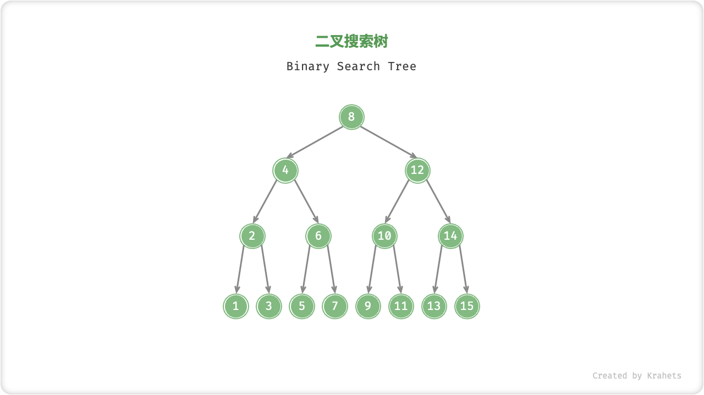

## 二叉搜索树的操作

### 查找结点

给定目标结点值 `num` ，可以根据二叉搜索树的性质来查找。我们声明一个结点 `cur` ，从二叉树的根结点 `root` 出发，循环比较结点值 `cur.val` 和 `num` 之间的大小关系

- 若 `cur.val < num` ，说明目标结点在 `cur` 的右子树中，因此执行 `cur = cur.right` ；
- 若 `cur.val > num` ，说明目标结点在 `cur` 的左子树中，因此执行 `cur = cur.left` ；
- 若 `cur.val = num` ，说明找到目标结点，跳出循环并返回该结点即可；

=== "<1>"
    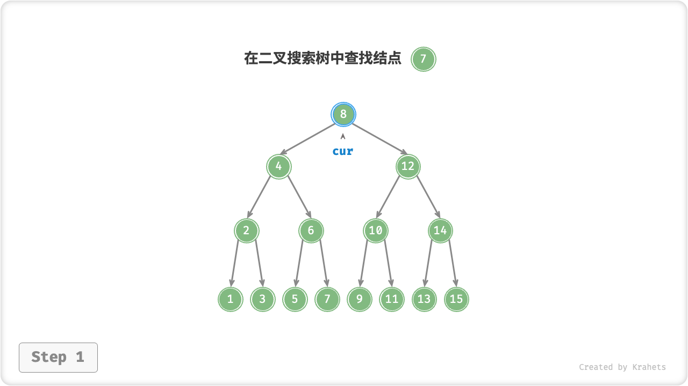

=== "<2>"
    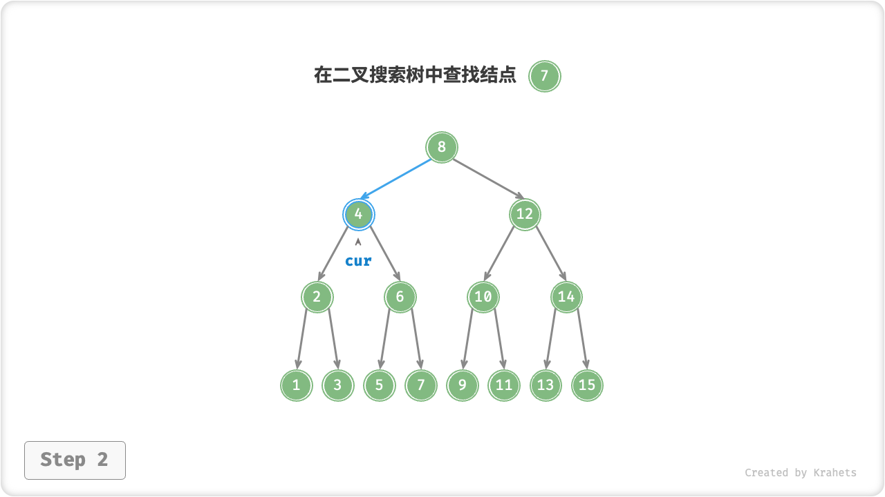

=== "<3>"
    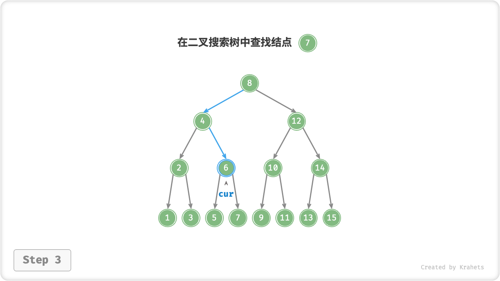

=== "<4>"
    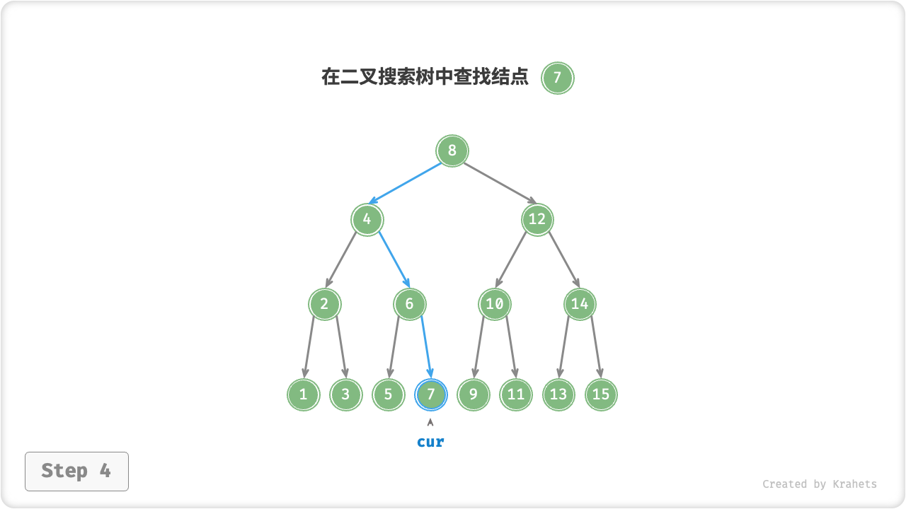

二叉搜索树的查找操作和二分查找算法如出一辙，也是在每轮排除一半情况。循环次数最多为二叉树的高度，当二叉树平衡时，使用 $O(\log n)$ 时间。

=== "Java"

    ```java title="binary_search_tree.java"
    [class]{BinarySearchTree}-[func]{search}
    ```

=== "C++"

    ```cpp title="binary_search_tree.cpp"
    [class]{BinarySearchTree}-[func]{search}
    ```

=== "Python"

    ```python title="binary_search_tree.py"
    [class]{BinarySearchTree}-[func]{search}
    ```

=== "Go"

    ```go title="binary_search_tree.go"
    [class]{binarySearchTree}-[func]{search}
    ```

=== "JavaScript"

    ```javascript title="binary_search_tree.js"
    [class]{}-[func]{search}
    ```

=== "TypeScript"

    ```typescript title="binary_search_tree.ts"
    [class]{}-[func]{search}
    ```

=== "C"

    ```c title="binary_search_tree.c"
    [class]{binarySearchTree}-[func]{search}
    ```

=== "C#"

    ```csharp title="binary_search_tree.cs"
    [class]{BinarySearchTree}-[func]{search}
    ```

=== "Swift"

    ```swift title="binary_search_tree.swift"
    [class]{BinarySearchTree}-[func]{search}
    ```

=== "Zig"

    ```zig title="binary_search_tree.zig"
    [class]{BinarySearchTree}-[func]{search}
    ```

### 插入结点

给定一个待插入元素 `num` ，为了保持二叉搜索树“左子树 < 根结点 < 右子树”的性质，插入操作分为两步：

1. **查找插入位置**：与查找操作类似，我们从根结点出发，根据当前结点值和 `num` 的大小关系循环向下搜索，直到越过叶结点（遍历到 $\text{null}$ ）时跳出循环；
2. **在该位置插入结点**：初始化结点 `num` ，将该结点放到 $\text{null}$ 的位置 ；

二叉搜索树不允许存在重复结点，否则将会违背其定义。因此若待插入结点在树中已经存在，则不执行插入，直接返回即可。

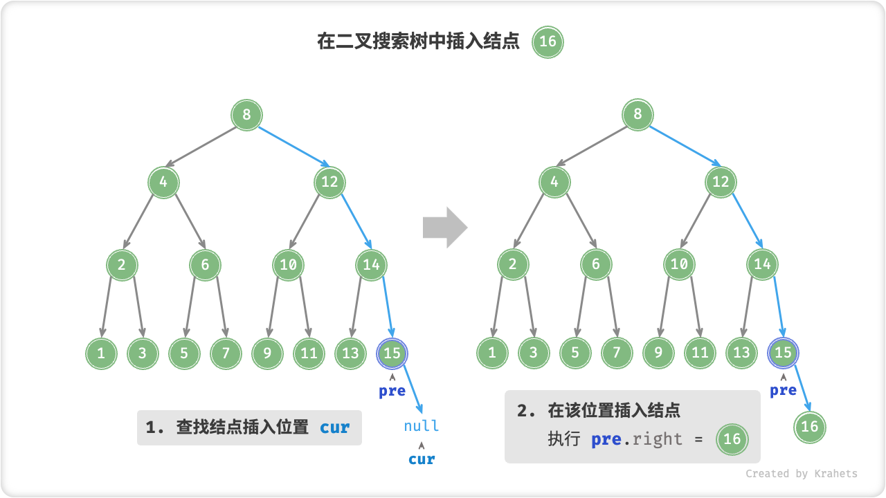

=== "Java"

    ```java title="binary_search_tree.java"
    [class]{BinarySearchTree}-[func]{insert}
    ```

=== "C++"

    ```cpp title="binary_search_tree.cpp"
    [class]{BinarySearchTree}-[func]{insert}
    ```

=== "Python"

    ```python title="binary_search_tree.py"
    [class]{BinarySearchTree}-[func]{insert}
    ```

=== "Go"

    ```go title="binary_search_tree.go"
    [class]{binarySearchTree}-[func]{insert}
    ```

=== "JavaScript"

    ```javascript title="binary_search_tree.js"
    [class]{}-[func]{insert}
    ```

=== "TypeScript"

    ```typescript title="binary_search_tree.ts"
    [class]{}-[func]{insert}
    ```

=== "C"

    ```c title="binary_search_tree.c"
    [class]{binarySearchTree}-[func]{insert}
    ```

=== "C#"

    ```csharp title="binary_search_tree.cs"
    [class]{BinarySearchTree}-[func]{insert}
    ```

=== "Swift"

    ```swift title="binary_search_tree.swift"
    [class]{BinarySearchTree}-[func]{insert}
    ```

=== "Zig"

    ```zig title="binary_search_tree.zig"
    [class]{BinarySearchTree}-[func]{insert}
    ```

为了插入结点，需要借助 **辅助结点 `pre`** 保存上一轮循环的结点，这样在遍历到 $\text{null}$ 时，我们也可以获取到其父结点，从而完成结点插入操作。

与查找结点相同，插入结点使用 $O(\log n)$ 时间。

### 删除结点

与插入结点一样，我们需要在删除操作后维持二叉搜索树的“左子树 < 根结点 < 右子树”的性质。首先，我们需要在二叉树中执行查找操作，获取待删除结点。接下来，根据待删除结点的子结点数量，删除操作需要分为三种情况：

**当待删除结点的子结点数量 $= 0$ 时**，表明待删除结点是叶结点，直接删除即可。

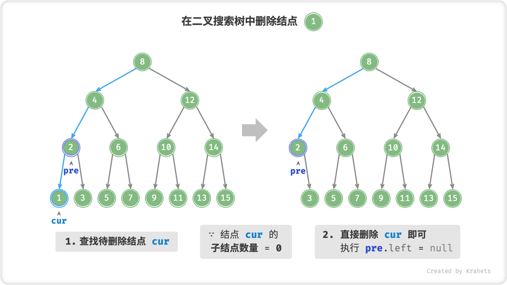

**当待删除结点的子结点数量 $= 1$ 时**，将待删除结点替换为其子结点即可。

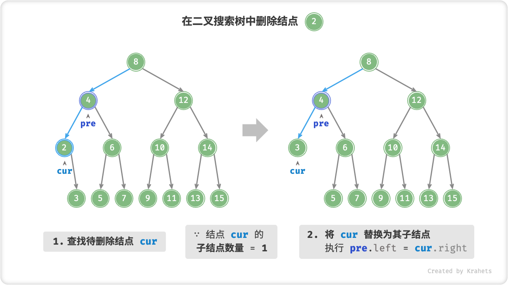

**当待删除结点的子结点数量 $= 2$ 时**，删除操作分为三步：

1. 找到待删除结点在 **中序遍历序列** 中的下一个结点，记为 `nex` ；
2. 在树中递归删除结点 `nex` ；
3. 使用 `nex` 替换待删除结点；

=== "<1>"
    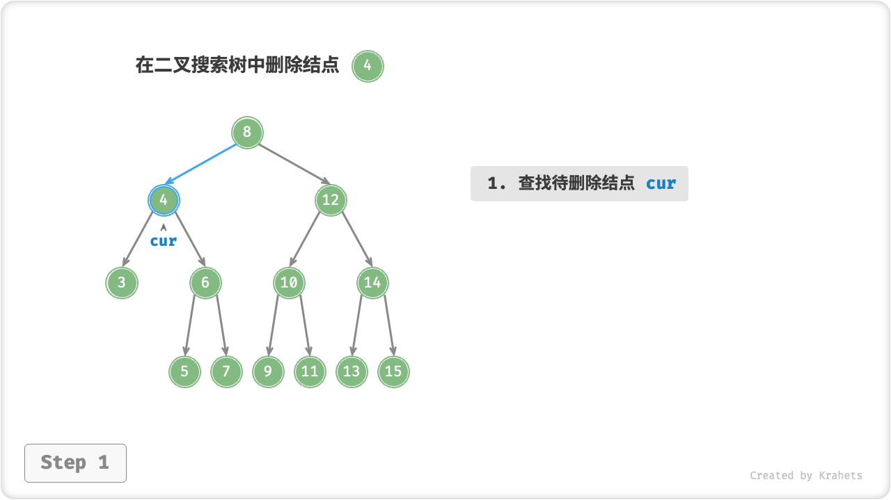

=== "<2>"
    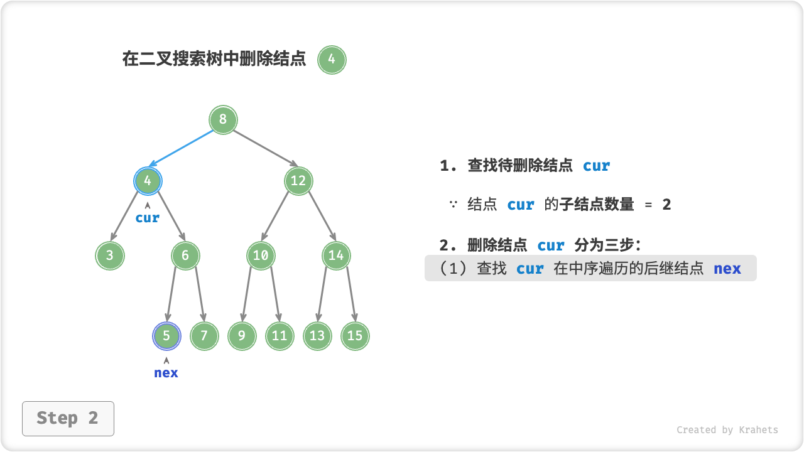

=== "<3>"
    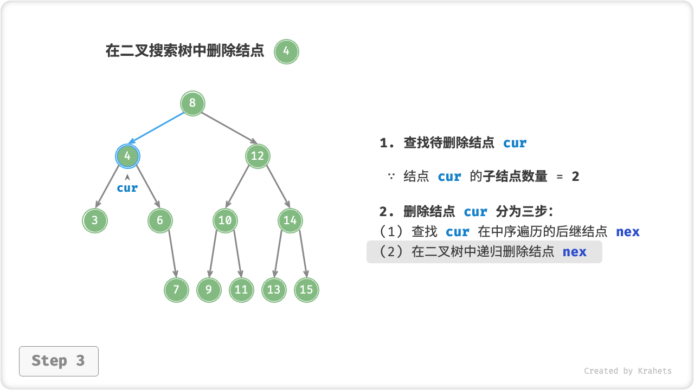

=== "<4>"
    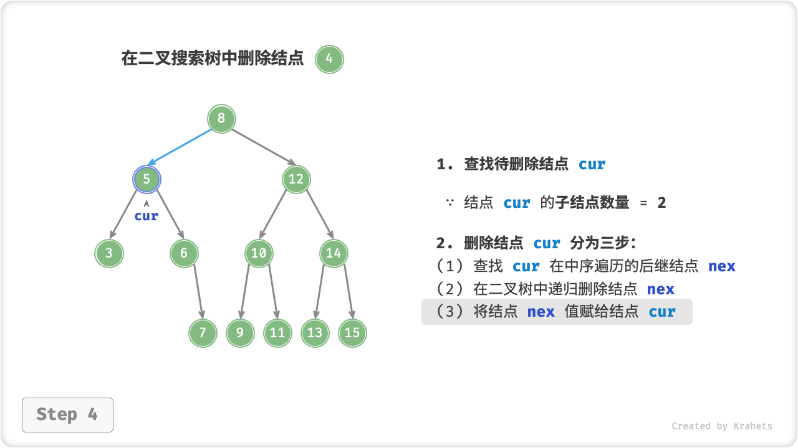

删除结点操作也使用 $O(\log n)$ 时间，其中查找待删除结点 $O(\log n)$ ，获取中序遍历后继结点 $O(\log n)$ 。

=== "Java"

    ```java title="binary_search_tree.java"
    [class]{BinarySearchTree}-[func]{remove}

    [class]{BinarySearchTree}-[func]{getInOrderNext}
    ```

=== "C++"

    ```cpp title="binary_search_tree.cpp"
    [class]{BinarySearchTree}-[func]{remove}

    [class]{BinarySearchTree}-[func]{getInOrderNext}
    ```

=== "Python"

    ```python title="binary_search_tree.py"
    [class]{BinarySearchTree}-[func]{remove}

    [class]{BinarySearchTree}-[func]{get_inorder_next}
    ```

=== "Go"

    ```go title="binary_search_tree.go"
    [class]{binarySearchTree}-[func]{remove}

    [class]{binarySearchTree}-[func]{getInOrderNext}
    ```

=== "JavaScript"

    ```javascript title="binary_search_tree.js"
    [class]{}-[func]{remove}

    [class]{}-[func]{getInOrderNext}
    ```

=== "TypeScript"

    ```typescript title="binary_search_tree.ts"
    [class]{}-[func]{remove}

    [class]{}-[func]{getInOrderNext}
    ```

=== "C"

    ```c title="binary_search_tree.c"
    [class]{binarySearchTree}-[func]{remove}

    [class]{binarySearchTree}-[func]{getInOrderNext}
    ```

=== "C#"

    ```csharp title="binary_search_tree.cs"
    [class]{BinarySearchTree}-[func]{remove}

    [class]{BinarySearchTree}-[func]{getInOrderNext}
    ```

=== "Swift"

    ```swift title="binary_search_tree.swift"
    [class]{BinarySearchTree}-[func]{remove}

    [class]{BinarySearchTree}-[func]{getInOrderNext}
    ```

=== "Zig"

    ```zig title="binary_search_tree.zig"
    [class]{BinarySearchTree}-[func]{remove}

    [class]{BinarySearchTree}-[func]{getInOrderNext}
    ```

### 排序

我们知道，「中序遍历」遵循“左 $\rightarrow$ 根 $\rightarrow$ 右”的遍历优先级，而二叉搜索树遵循“左子结点 $<$ 根结点 $<$ 右子结点”的大小关系。因此，在二叉搜索树中进行中序遍历时，总是会优先遍历下一个最小结点，从而得出一条重要性质：**二叉搜索树的中序遍历序列是升序的**。

借助中序遍历升序的性质，我们在二叉搜索树中获取有序数据仅需 $O(n)$ 时间，而无需额外排序，非常高效。

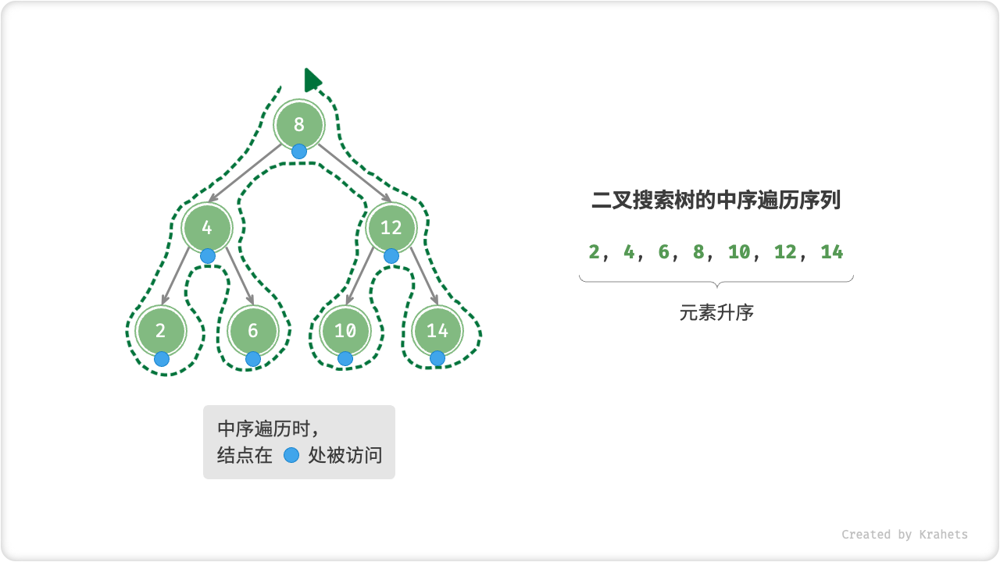

## 二叉搜索树的效率

假设给定 $n$ 个数字，最常用的存储方式是「数组」，那么对于这串乱序的数字，常见操作的效率为：

- **查找元素**：由于数组是无序的，因此需要遍历数组来确定，使用 $O(n)$ 时间；
- **插入元素**：只需将元素添加至数组尾部即可，使用 $O(1)$ 时间；
- **删除元素**：先查找元素，使用 $O(n)$ 时间，再在数组中删除该元素，使用 $O(n)$ 时间；
- **获取最小 / 最大元素**：需要遍历数组来确定，使用 $O(n)$ 时间；

为了得到先验信息，我们也可以预先将数组元素进行排序，得到一个「排序数组」，此时操作效率为：

- **查找元素**：由于数组已排序，可以使用二分查找，平均使用 $O(\log n)$ 时间；
- **插入元素**：先查找插入位置，使用 $O(\log n)$ 时间，再插入到指定位置，使用 $O(n)$ 时间；
- **删除元素**：先查找元素，使用 $O(\log n)$ 时间，再在数组中删除该元素，使用 $O(n)$ 时间；
- **获取最小 / 最大元素**：数组头部和尾部元素即是最小和最大元素，使用 $O(1)$ 时间；

观察发现，无序数组和有序数组中的各项操作的时间复杂度是“偏科”的，即有的快有的慢；**而二叉搜索树的各项操作的时间复杂度都是对数阶，在数据量 $n$ 很大时有巨大优势**。

<div class="center-table" markdown>

|                     | 无序数组 | 有序数组    | 二叉搜索树  |
| ------------------- | -------- | ----------- | ----------- |
| 查找指定元素        | $O(n)$   | $O(\log n)$ | $O(\log n)$ |
| 插入元素            | $O(1)$   | $O(n)$      | $O(\log n)$ |
| 删除元素            | $O(n)$   | $O(n)$      | $O(\log n)$ |
| 获取最小 / 最大元素 | $O(n)$   | $O(1)$      | $O(\log n)$ |

</div>

## 二叉搜索树的退化

理想情况下，我们希望二叉搜索树的是“左右平衡”的（详见「平衡二叉树」章节），此时可以在 $\log n$ 轮循环内查找任意结点。

如果我们动态地在二叉搜索树中插入与删除结点，**则可能导致二叉树退化为链表**，此时各种操作的时间复杂度也退化之 $O(n)$ 。

!!! note

    在实际应用中，如何保持二叉搜索树的平衡，也是一个需要重要考虑的问题。

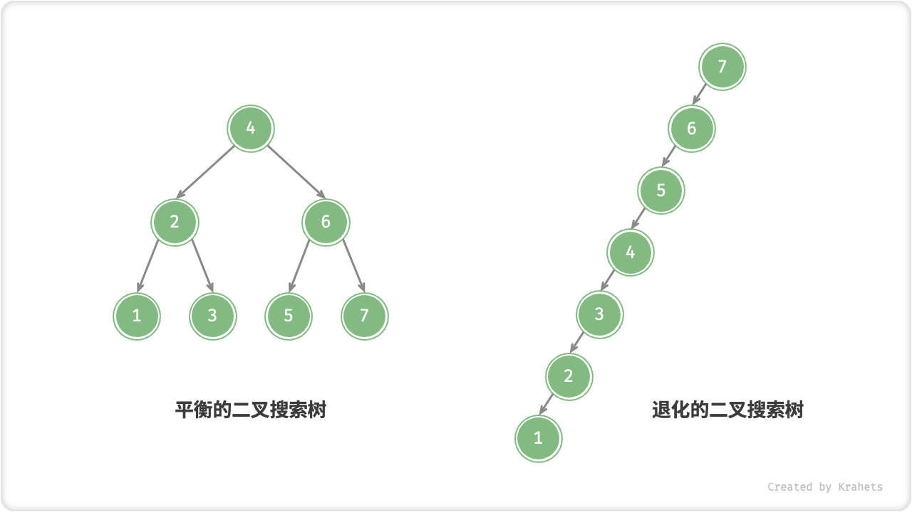

## 二叉搜索树常见应用

- 系统中的多级索引，高效查找、插入、删除操作。
- 各种搜索算法的底层数据结构。
- 存储数据流，保持其已排序。
